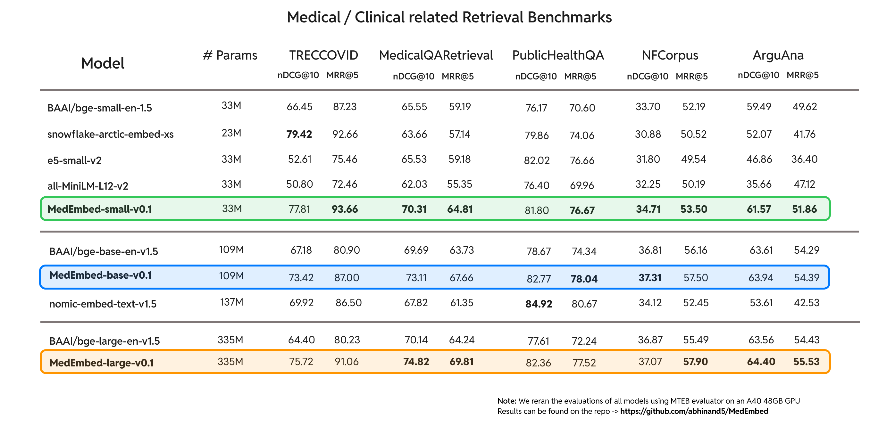
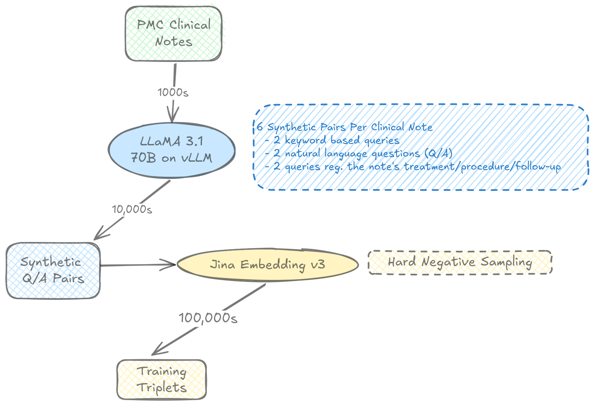

# MedEmbed: Medical-Focused Embedding Models

MedEmbed is a collection of embedding models fine-tuned specifically for medical and clinical data, aimed at enhancing performance in healthcare-related natural language processing (NLP) tasks.



> **Note:** These models are a work in progress, successive releases will be aimed at improving the performance even better and creating a medical embedding leaderboard on MTEB. Also, the work is almost done for late-interation based retrievers based on ColBERT.

## Project Overview

MedEmbed provides high-quality embedding models tailored for use in medical and clinical contexts. These models are designed to capture the nuances and complexities of medical terminology and concepts, making them particularly useful for a wide range of healthcare-related NLP tasks.

## Key Features

- Fine-tuned embedding models focused on medical and clinical data
- Improved performance on healthcare-specific NLP tasks
- Multiple model variants to suit different use cases and computational requirements
- Extensive evaluation on medical NLP benchmarks

## Model Variants

MedEmbed includes several model variants, each fine-tuned using different strategies:

- MedEmbed-Small-v1
- MedEmbed-Base-v1
- MedEmbed-Large-v1

> **Note:** We have also finetuned ColBERT-v2 models, benchmarking is in progress.

## Performance

Our models have been evaluated on various medical NLP benchmarks for retrieval, including:

- ArguAna
- MedicalQARetrieval
- NFCorpus
- PublicHealthQA
- TRECCOVID

### Key Findings

1. **Small Models:**
   - MedEmbed-Small-v1 consistently outperformed the base `BAAI/bge-small-en-v1.5` model across all benchmarks.

2. **Base Models:**
   - MedEmbed-Base-v0 showed significant improvements over the base `BAAI/bge-base-en-v1.5 model`.

3. **Large Models:**
   - `MedEmbed-Large-v0` demonstrated superior performance compared to the base `BAAI/bge-large-en-v1.5 model`.

4. **Cross-Size Comparison:**
   - In a comparison across different model sizes, `MedEmbed-Large-v0` showed the best overall performance.
   - Notably, the medical-tuned small and base models often outperformed the larger base models, indicating significant improvements from domain-specific fine-tuning.

> **Note:** More comparisons will be added with other frontier models along with a table.

## Data Generation and Training Process

Our models are trained using a sophisticated synthetic data generation pipeline, leveraging the power of large language models and real-world clinical data.

### Synthetic Data Generation Process



1. **Clinical Notes**: We start with a large corpus of patient data clinical notes from PubMed Central (PMC).

2. **LLM Processing**: These notes are processed through the LLaMA 2 70B model to generate high-quality query-response pairs.

3. **Negative Sampling**: We perform negative sampling to create challenging negative examples.

4. **Triplet Formation**: The positive and negative examples are combined to form triplets (query, positive response, negative response).

5. **Contrastive Learning**: These triplets are used to train our models using contrastive learning techniques inspired by ColBERT and BERT.

This innovative approach allows us to leverage the vast knowledge encoded in large language models while grounding our training data in real-world clinical information, resulting in embedding models that are both comprehensive and medically accurate.

## Getting Started

### Usage

[To be added]

## Contributing
[To be added]

## Citation

If you use MedEmbed in your research, please cite our work:

```
@software{balachandran2024medembed,
  author = {Balachandran, Abhinand},
  title = {MedEmbed: Medical-Focused Embedding Models},
  year = {2024},
  url = {https://github.com/abhinand5/MedEmbed}
}
```

## License

This project is licensed under the Apache License Version 2.0. See the [LICENSE](LICENSE) file for details.

## Contact

For any queries regarding the codebase or research, please reach out to Abhinand Balachandran at abhinandb.ml@gmail.com.
